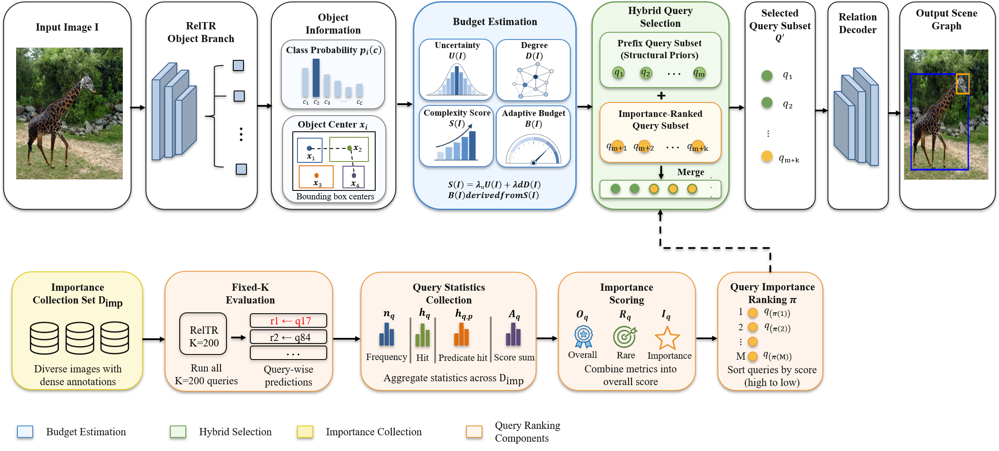

# Dynamic Relation Query Allocation for Scene Graph Generation

## 연구 개요

본 프로젝트는 Scene Graph Generation(SGG)에서 관계 후보 수가 객체 수에 따라 급격히 증가하는 `relation candidate explosion` 문제를 줄이는 방향을 탐구하기 위한 연구 작업 공간이다. 현재 연구의 중심 질문은 다음과 같다.

- one-stage/query-based SGG에서 relation query 수를 줄여도 성능을 얼마나 유지할 수 있는가
- fixed sparse query와 adaptive query budgeting 사이의 성능-효율 trade-off는 어떠한가
- 평균 query budget을 낮추면서도 `R@100`, `mR@100`을 얼마나 보존할 수 있는가

현재 기준 baseline은 `RelTR`이며, 향후 `Scene-Graph-Benchmark.pytorch` 계열 two-stage baseline과 비교 분석하는 것을 목표로 한다.


## 전체 방법 개요



**그림 1. Adaptive Relation Query Allocation(ARQA)의 전체 구조.**  
본 연구는 RelTR의 one-stage/query-based Scene Graph Generation 구조를 기반으로 하되, 모든 relation query를 고정적으로 사용하는 대신 이미지별 복잡도와 query 중요도를 고려하여 relation decoder에 입력되는 query subset을 선택한다. 먼저 입력 이미지에서 RelTR object branch를 통해 객체 class probability와 bounding box center 정보를 얻고, 이를 바탕으로 이미지의 uncertainty와 object degree 기반 복잡도 score를 계산한다. 이후 계산된 score로 adaptive budget `B(I)`를 추정하고, 이 budget에 맞춰 relation query subset을 구성한다.

ARQA의 query selection은 두 부분으로 구성된다. 첫 번째는 pretrained RelTR이 학습한 query 순서와 구조적 prior를 보존하기 위한 prefix query subset이며, 두 번째는 별도의 importance collection set에서 수집한 query-wise statistics를 기반으로 선택되는 importance-ranked query subset이다. 두 subset을 병합하여 최종 selected query subset `Q'`를 만들고, 이를 relation decoder에 입력하여 최종 scene graph를 예측한다.

이 구조의 핵심 목적은 relation query 수를 단순히 줄이는 것이 아니라, 성능에 기여할 가능성이 높은 query를 우선적으로 유지함으로써 평균 query budget을 낮추면서도 `R@100`과 `mR@100`을 최대한 보존하는 것이다.

## 연구 상태

현재까지 완료된 핵심 단계는 다음과 같다.

1. 실험 환경 구축
2. Visual Genome 기반 RelTR baseline 재현
3. fixed sparse / post-hoc top-K / adaptive query budgeting 실험
4. query importance statistics 수집 및 selection 실험 준비

즉 현재 단계는 `baseline 재현 완료 후 효율화 실험 및 비교 프레임 정리 단계`로 볼 수 있다.

## 저장소 구성

- `repos/RelTR`
  현재 one-stage/query-based baseline 및 query budget 관련 실험의 주 작업 공간
- `repos/Scene-Graph-Benchmark.pytorch`
  two-stage SGG baseline 분석 및 추후 비교 실험용 코드베이스

## RelTR 코드베이스 메모

RelTR는 query-based one-stage Scene Graph Generation 모델이다. 원본 README는 주로 Python 3.6 / PyTorch 1.6 환경을 기준으로 작성되어 있지만, 현재 로컬 실험은 수정된 GPU 환경과 호환성 패치를 반영한 상태에서 진행하고 있다.

따라서 실제 baseline 재현과 후속 실험은 원본 설치 절차 전체를 그대로 따르기보다, 이 프로젝트 루트 README에 정리된 실행 명령, 데이터 경로, 체크포인트 경로, 그리고 로컬 코드 수정 사항을 기준으로 수행한다.

## 실험 원칙

현재 adaptive 계열 실험에서는 아래 기능을 메인 proposed method에서 사용하지 않는 방향으로 정리하고 있다.

- object pruning
- object filtering
- object query projection
- relation query embedding modification

즉 pretrained RelTR의 learned relation query distribution을 최대한 유지한 상태에서, `query budget 자체를 조절하는 방식`을 우선 실험 대상으로 삼는다.

## 실험 환경

- OS: Windows + WSL Ubuntu
- Editor: VS Code (WSL)
- Python: Miniconda
- 대표 conda env: `sgg_onestage_gpu`

```bash
source ~/miniconda3/etc/profile.d/conda.sh
conda activate sgg_onestage_gpu
```

## 데이터 및 체크포인트 경로

```text
RelTR code
/home/com/sgg-project/repos/scene-graph/repos/RelTR

Visual Genome data
/home/com/sgg-project/repos/RelTR/data/vg/

Pretrained checkpoint
/home/com/sgg-project/repos/RelTR/ckpt/checkpoint0149.pth
```


## 실험 결과 요약

### Fixed-K query budget 비교

| K | R@20 | R@50 | R@100 | mR@20 | mR@50 | mR@100 | Time/it |
|---:|---:|---:|---:|---:|---:|---:|---:|
| 200 | 0.203840 | 0.252161 | 0.273441 | 0.056952 | 0.084153 | 0.098901 | 0.0698 |
| 180 | 0.200245 | 0.245876 | 0.265703 | 0.056375 | 0.082357 | 0.095482 | 0.0715 |
| 150 | 0.195252 | 0.237720 | 0.254870 | 0.057600 | 0.078380 | 0.093120 | 0.0689 |
| 100 | 0.174835 | 0.205734 | 0.214883 | 0.053270 | 0.071530 | 0.079000 | 0.0683 |
| 50 | 0.120646 | 0.133110 | 0.133110 | 0.045430 | 0.052750 | 0.052750 | 0.0676 |

**표 1. Fixed-K relation query budget에 따른 성능 변화.**  
표 1은 relation query 수 `K`를 고정적으로 줄였을 때의 성능 변화를 보여준다. `K=200`은 가장 높은 `R@100`과 `mR@100`을 보이며, query 수를 줄일수록 전반적인 recall 성능이 감소하는 경향을 확인할 수 있다. 특히 `K=100` 이하에서는 `R@100`과 `mR@100`이 크게 하락하므로, relation query를 단순히 줄이는 방식만으로는 성능 보존에 한계가 있다. 반면 `K=180`은 `K=200` 대비 query 수를 줄이면서도 비교적 높은 성능을 유지하므로, adaptive query budgeting 및 ARQA와 비교하기 위한 중요한 fixed sparse baseline으로 사용된다.

## 대표 실험 흐름

### 1. Baseline evaluation

```bash
cd /home/com/sgg-project/repos/scene-graph/repos/RelTR

python -u main.py \
  --dataset vg \
  --img_folder /home/com/sgg-project/repos/RelTR/data/vg/images/ \
  --ann_path /home/com/sgg-project/repos/RelTR/data/vg/ \
  --eval \
  --batch_size 1 \
  --resume /home/com/sgg-project/repos/RelTR/ckpt/checkpoint0149.pth
```

## 재현 절차

다른 PC 또는 새로운 환경에서 현재 실험을 다시 수행하려면, 단순히 코드만 clone하는 것으로는 충분하지 않다. 아래 네 가지를 함께 맞춰야 한다.

1. 코드 저장소
2. Visual Genome 데이터
3. pretrained checkpoint
4. Python / PyTorch / CUDA 환경

### 1. 저장소 clone

```bash
git clone https://github.com/yevon0325/scene-graph.git
cd scene-graph
```

### 2. conda 환경 구성

현재 실험은 WSL + conda 환경에서 수행했다. 기본적으로는 아래와 같은 흐름으로 맞추는 것을 권장한다.

```bash
source ~/miniconda3/etc/profile.d/conda.sh
conda create -n sgg_onestage_gpu python=3.10
conda activate sgg_onestage_gpu
```

이후 PyTorch, torchvision, 기타 의존 패키지는 현재 GPU/CUDA 환경에 맞게 설치해야 한다. 실제 사용 GPU와 CUDA 버전에 따라 설치 명령은 달라질 수 있다.

### 3. Visual Genome 데이터 준비

RelTR baseline 실험을 위해서는 최소한 아래 구조가 준비되어 있어야 한다.

```text
/home/com/sgg-project/repos/RelTR/data/vg/
├── images/
├── train.json
├── val.json
├── test.json
└── rel.json
```

즉, 데이터는 `scene-graph/repos/RelTR/data/vg/`가 아니라 현재 로컬 기준으로 `/home/com/sgg-project/repos/RelTR/data/vg/` 위치를 사용하고 있다.

### 4. pretrained checkpoint 준비

다음 파일이 필요하다.

```text
/home/com/sgg-project/repos/RelTR/ckpt/checkpoint0149.pth
```

실험 명령은 이 체크포인트 경로를 기준으로 작성되어 있다.

### 5. Cextension 빌드

평가 시 bbox overlap 계산을 위해 Cython/C extension이 필요하다. 새 환경에서는 아래 빌드를 다시 수행해야 할 수 있다.

```bash
cd /home/com/sgg-project/repos/scene-graph/repos/RelTR/lib/fpn/box_intersections_cpu
python setup.py build_ext --inplace
```

또는 상위 스크립트를 사용할 수도 있다.

```bash
cd /home/com/sgg-project/repos/scene-graph/repos/RelTR/lib/fpn
bash make.sh
```

### 6. baseline evaluation 실행

```bash
cd /home/com/sgg-project/repos/scene-graph/repos/RelTR

python -u main.py \
  --dataset vg \
  --img_folder /home/com/sgg-project/repos/RelTR/data/vg/images/ \
  --ann_path /home/com/sgg-project/repos/RelTR/data/vg/ \
  --eval \
  --batch_size 1 \
  --resume /home/com/sgg-project/repos/RelTR/ckpt/checkpoint0149.pth
```

### 7. fixed sparse / adaptive 실험 실행

fixed sparse 예시:

```bash
python -u main.py \
  --dataset vg \
  --img_folder /home/com/sgg-project/repos/RelTR/data/vg/images/ \
  --ann_path /home/com/sgg-project/repos/RelTR/data/vg/ \
  --eval \
  --batch_size 1 \
  --resume /home/com/sgg-project/repos/RelTR/ckpt/checkpoint0149.pth \
  --sparse_query_k 180
```

adaptive 예시:

```bash
python -u main.py \
  --dataset vg \
  --img_folder /home/com/sgg-project/repos/RelTR/data/vg/images/ \
  --ann_path /home/com/sgg-project/repos/RelTR/data/vg/ \
  --eval \
  --batch_size 1 \
  --resume /home/com/sgg-project/repos/RelTR/ckpt/checkpoint0149.pth \
  --sparse_query_k 200 \
  --adaptive_query_budget \
  --budget_min 125 \
  --budget_max 185 \
  --budget_score_bias 0.62 \
  --budget_score_scale 0.25 \
  --enable_budget_floor \
  --adaptive_budget_floor 125 \
  --target_avg_budget 155 \
  --lambda_uncertainty 0.5 \
  --lambda_degree 1.0
```

### 8. 재현 시 주의사항

- pretrained checkpoint만 있다고 끝나는 것이 아니라, 데이터 경로와 extension 빌드가 맞아야 한다.
- PyTorch 버전 차이로 `torch.load` 동작이 달라질 수 있으므로, 현재 코드 수정 상태를 그대로 사용하는 것이 좋다.
- GPU가 다르면 속도와 메모리 수치는 달라질 수 있다.
- 실험 로그의 `R@K`, `mR@K`, `time / it`, `max mem`은 하드웨어와 환경에 따라 약간 달라질 수 있다.

### 2. Fixed sparse evaluation

예시: `K=180`

```bash
python -u main.py \
  --dataset vg \
  --img_folder /home/com/sgg-project/repos/RelTR/data/vg/images/ \
  --ann_path /home/com/sgg-project/repos/RelTR/data/vg/ \
  --eval \
  --batch_size 1 \
  --resume /home/com/sgg-project/repos/RelTR/ckpt/checkpoint0149.pth \
  --sparse_query_k 180 \
  --output_dir fixed_sparse_k180_eval \
  2>&1 | tee fixed_sparse_k180.log
```

### 3. Post-hoc top-K evaluation

예시: `K=100`

```bash
python -u main.py \
  --dataset vg \
  --img_folder /home/com/sgg-project/repos/RelTR/data/vg/images/ \
  --ann_path /home/com/sgg-project/repos/RelTR/data/vg/ \
  --eval \
  --batch_size 1 \
  --resume /home/com/sgg-project/repos/RelTR/ckpt/checkpoint0149.pth \
  --sparse_query_k 200 \
  --eval_topk_triplets 100 \
  --output_dir eval_topk_100 \
  2>&1 | tee eval_topk_100.log
```

### 4. Safe Object-Aware Adaptive Query Budgeting

예시: 평균 budget 155 근처를 목표로 한 설정

```bash
python -u main.py \
  --dataset vg \
  --img_folder /home/com/sgg-project/repos/RelTR/data/vg/images/ \
  --ann_path /home/com/sgg-project/repos/RelTR/data/vg/ \
  --eval \
  --batch_size 1 \
  --resume /home/com/sgg-project/repos/RelTR/ckpt/checkpoint0149.pth \
  --sparse_query_k 200 \
  --adaptive_query_budget \
  --budget_min 125 \
  --budget_max 185 \
  --budget_score_bias 0.68 \
  --budget_score_scale 0.24 \
  --enable_budget_floor \
  --adaptive_budget_floor 125 \
  --target_avg_budget 155 \
  --lambda_uncertainty 0.5 \
  --lambda_degree 1.0 \
  --output_dir soaaqb_budget155_b068_s024 \
  2>&1 | tee soaaqb_budget155_b068_s024.log
```

### 5. Query importance statistics 수집

```bash
python -u main.py \
  --dataset vg \
  --img_folder /home/com/sgg-project/repos/RelTR/data/vg/images/ \
  --ann_path /home/com/sgg-project/repos/RelTR/data/vg/ \
  --eval \
  --batch_size 1 \
  --resume /home/com/sgg-project/repos/RelTR/ckpt/checkpoint0149.pth \
  --sparse_query_k 200 \
  --collect_query_importance \
  --query_importance_output query_importance_stats.pt \
  --output_dir query_importance_collect \
  2>&1 | tee query_importance_collect.log
```

### 6. Query importance selection 평가

예시: `hybrid_prefix`

```bash
python -u main.py \
  --dataset vg \
  --img_folder /home/com/sgg-project/repos/RelTR/data/vg/images/ \
  --ann_path /home/com/sgg-project/repos/RelTR/data/vg/ \
  --eval \
  --batch_size 1 \
  --resume /home/com/sgg-project/repos/RelTR/ckpt/checkpoint0149.pth \
  --sparse_query_k 200 \
  --adaptive_query_budget \
  --budget_min 125 \
  --budget_max 185 \
  --budget_score_bias 0.62 \
  --budget_score_scale 0.25 \
  --enable_budget_floor \
  --adaptive_budget_floor 125 \
  --target_avg_budget 155 \
  --lambda_uncertainty 0.5 \
  --lambda_degree 1.0 \
  --query_importance_selection \
  --query_importance_path query_importance_stats.pt \
  --query_selection_mode hybrid_prefix \
  --prefix_keep_ratio 0.5 \
  --output_dir soaaqb163_query_importance_hybrid \
  2>&1 | tee soaaqb163_query_importance_hybrid.log
```


### Budget-only와 ARQA 비교

| Method | Avg. Budget | R@20 | R@50 | R@100 | mR@20 | mR@50 | mR@100 | Time/it |
|---|---:|---:|---:|---:|---:|---:|---:|---:|
| Budget-only | 162.67 | 0.197740 | 0.240880 | 0.259311 | 0.056611 | 0.081186 | 0.096892 | 0.0737 |
| ARQA | 162.67 | 0.202319 | 0.249195 | 0.269688 | 0.056575 | 0.084514 | 0.099493 | 0.0751 |

**표 2. Budget-only 방식과 ARQA의 성능 비교.**  
표 2는 동일한 평균 query budget 조건에서 Budget-only 방식과 제안 방법인 ARQA를 비교한 결과이다. Budget-only는 이미지별 adaptive budget만 적용하여 relation decoder에 입력되는 query 수를 조절하는 방식이다. 반면 ARQA는 adaptive budget에 더해 query importance statistics를 활용하여 중요한 relation query를 우선적으로 선택한다.

실험 결과, ARQA는 Budget-only와 동일한 평균 budget인 162.67을 사용하면서도 `R@100`을 0.259311에서 0.269688로 향상시켰고, `mR@100` 역시 0.096892에서 0.099493으로 향상시켰다. 이는 단순히 query 수를 조절하는 것보다, 어떤 query를 선택할 것인지까지 함께 고려하는 것이 scene graph generation 성능 보존에 더 효과적임을 보여준다. 다만 `Time/it`은 0.0737에서 0.0751로 소폭 증가하므로, 본 연구의 핵심 주장은 wall-clock speedup보다는 낮은 평균 query budget에서의 성능 보존 및 향상에 초점을 둔다.

## 주요 평가 지표

RelTR 계열 실험에서는 아래 지표를 중심으로 비교한다.

- `R@20`, `R@50`, `R@100`
- `mR@20`, `mR@50`, `mR@100`
- `AP@[.50:.95]`, `AP@0.50`, `AR@100`
- `Test: Total time`
- `time / it`
- `relation_decoder_time_ms`
- `adaptive_budget_time_ms`
- `GPU max memory allocated`
- `GPU max memory reserved`
- `max mem`
- adaptive budget summary / histogram


## 코드 수정 핵심 파일

현재 실험에서 주로 수정된 파일은 아래와 같다.

- `repos/RelTR/main.py`
- `repos/RelTR/engine.py`
- `repos/RelTR/models/reltr.py`
- `repos/RelTR/models/transformer.py`
- `repos/RelTR/model_stats.py`

## 기록 및 관리 메모

- `repos/RelTR`는 상위 저장소에 submodule로 연결되어 있다.
- 대표 adaptive baseline은 submodule commit/tag와 상위 repo commit으로 함께 관리한다.
- 실험 로그, 출력 폴더, 임시 산출물은 기본적으로 버전 관리 대상이 아니라 로컬 실험 산출물로 취급한다.
- 이후 README는 단순 사용 설명서가 아니라, `실험 재현 절차 + 연구 진행 메모`를 함께 담는 문서로 유지한다.
